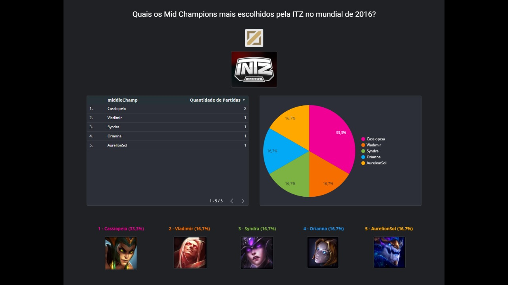
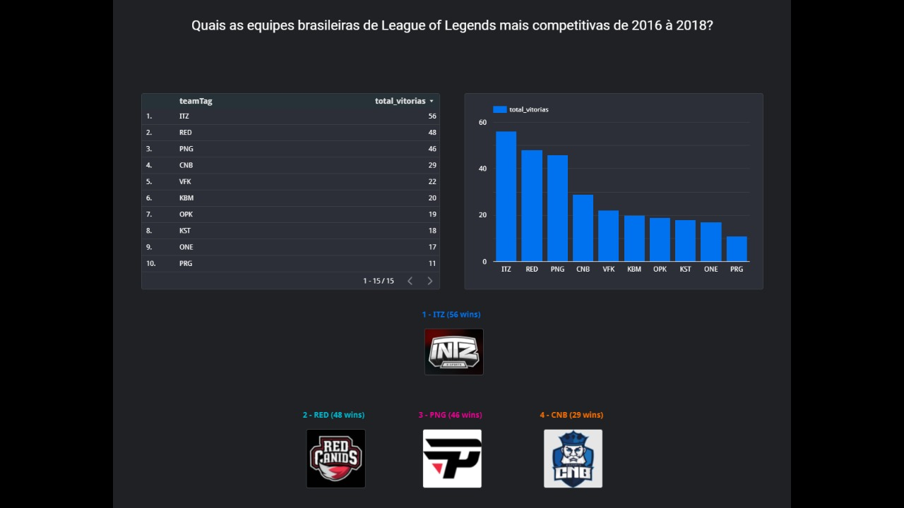
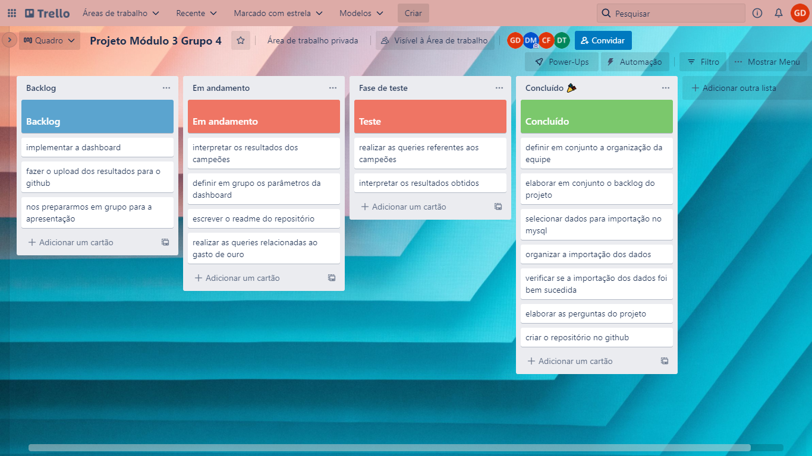
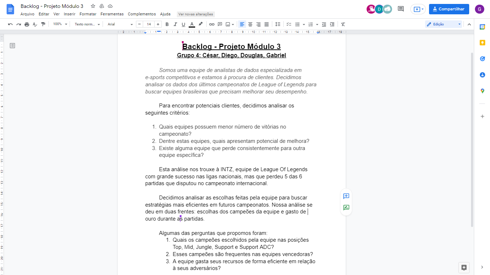

# Projeto final do módulo 3 "League Of Legends" 🎮

<h2 id="oprojeto">O Projeto</h2>
  
O projeto proposto pela Resilia Educação foi de montar um dashboard com base em um conjunto de dados escolhidos pelo nosso grupo, no final do projeto realizar uma apresenação do dashboard monstrando como utilizamos esses dados.

  
  <h2 id="nossaequipe"> Nossa Equipe </h2>
   <h5>Nosso Squad é composto pelos seguintes Desenvolvedores:</h5>
  <ul>
  <li>Douglas Montes</li>
  <li> Cesár Freitas</li>
  <li>Diego Tolotto </li>
  <li>Gabriel Dias</li>
 </ul>
  
 Somos uma equipe de analistas de dados especializada em e-sports competitivos e estamos à procura de clientes. Decidimos analisar os dados dos últimos campeonatos de League of Legends para buscar equipes que precisam melhorar seu desempenho. Escolhemos a equipe INTZ.

  
 Fizemos a Analise de dados, exploramos cada detalhe e conseguimos obter um otimo resultado na Analise, desta forma iremos conseguir ajudar a melhorar o desempenho da equipe de forma extraordinaria.

  <h5> Veja abaixo algumas imagens dos Graficos: </h5>
    
    
    
    
<h5>SCRUM & KANBAN</h5>
 
Para manter o projeto bem organizado, otimizar o tempo e entregar no prazo, utilizamos 2 metedologias ágeis, SCRUM e Kanban. Ao iniciar criamos o product backlog, nosso projeto foi feito em 2 sprints, fizemos as daily meeting, utilizamos o quadro KANBAN para organizar melhor as tarefas e para uma melhor visualização delas. 

  
 <h2 id="ferramentas"> Ferramentas Utilizadas </h2>
 <ul>
  <li>MySQL Workbench</li>
  <li>Data Studio </li>
  <li>Metodologia SCRUM</li>
 </ul>
  <h2 id="conhecimentos">Conhecimentos adquiridos</h2>
  <ul>
  <li> Querys Avançadas e Sub Querys</li>
  <li>Data Studio</li>
  <li>SCRUM</li>
 </ul>
  

